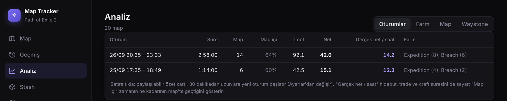
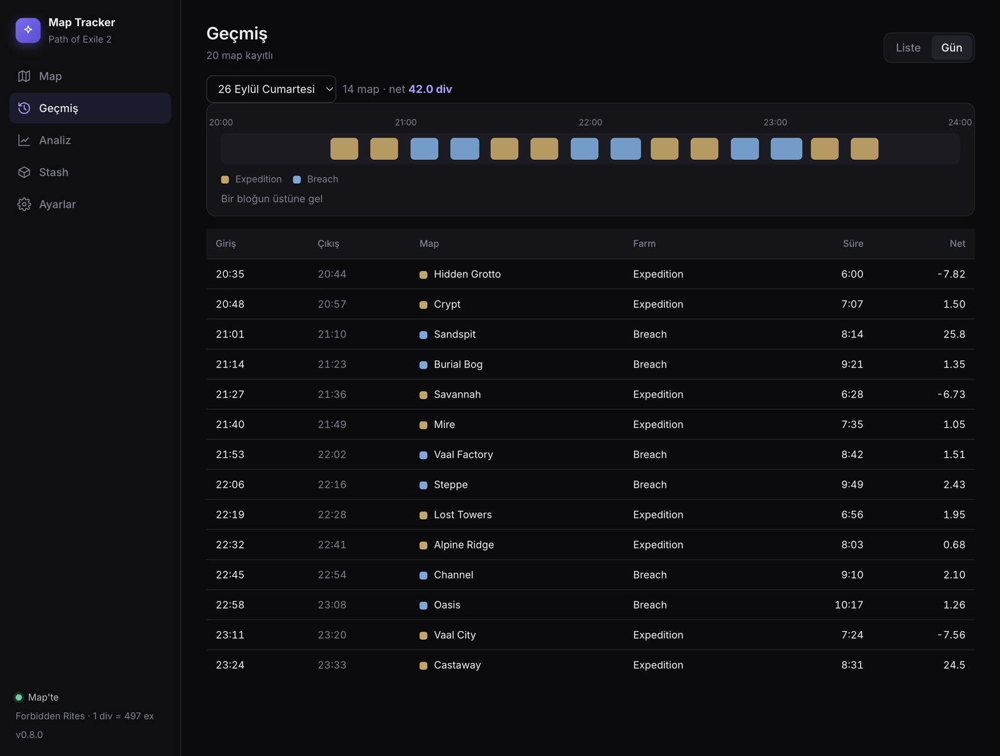
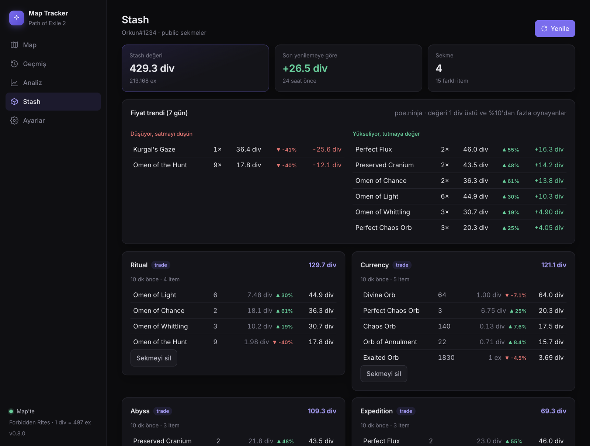

<p align="center">
  
</p>

<p align="center">
  <a href="../../releases/latest"></a>
  
  
  
</p>

<p align="center">
  <a href="../../releases/latest"><b>⬇️ İndir (portable .exe)</b></a> ·
  <a href="#-nasıl-çalışır">Nasıl çalışır</a> ·
  <a href="#%EF%B8%8F-kısayollar">Kısayollar</a> ·
  <a href="#-analiz">Analiz</a>
</p>

---

Her map'e **hangi waystone ve tabletlerle** girdiğini, **süreyi**, **ölümleri**, **loot'u** ve **net kârı** (loot − tablet maliyeti) otomatik kaydeder. Oyunun üstünde duran küçük panelden alt-tab yapmadan loot girersin.

<p align="center">
  
</p>

## ✨ Özellikler

| | |
| :-- | :-- |
| 🗺️ **Otomatik map takibi** | Map'e giriş/çıkış, area level, süre ve ölümler `Client.txt`'ten gelir |
| 🪨 **Waystone & tablet** | `Ctrl+Alt+C` ile Rarity, Pack Size, Monster Effectiveness ve tablet türleri kaydedilir |
| 💰 **Loot & değerli item** | Currency butonları + unique'ler için elle Divine değeri (ör. `20` Mageblood) |
| 🔁 **Otomatik loot** | Map'e girince stash okunur, sonraki okumayla farkı o map'in kazancı olur; elle giriş gerekmez |
| 🏷️ **Kendi fiyatların** | poe.ninja'da olmayan unique/gem'lere bir kez değer ver; stash ve map kazancında kullanılır |
| 🚩 **Şüpheli map** | Map'ler arası trade/craft stash farkına karışırsa işaretlenir; satırı ya da map'i hesaptan çıkarabilirsin |
| 🗂️ **Lig ayrımı** | Her map ligini hatırlar; Geçmiş ve Analiz varsayılan olarak aktif ligi gösterir |
| 🧾 **Tablet maliyeti** | "3 tablet 20 div, 10 kullanım" gir; map başına maliyet ve net kâr otomatik |
| 🧪 **Juice maliyeti** | Farm'ına göre poe.ninja'nın en pahalı 10 item'ı: Ritual → omen'ler, Abyss → abyss currency'leri, Breach → catalyst'ler… |
| ⏱️ **Gerçek saatlik** | Oturum bazlı div/saat: hideout, trade ve craft süresi de dahil |
| 📊 **İstatistik** | Oturumlar, farm, map, 3 vs 4 tablet, setup, saatlik ve waystone stat aralıkları |
| 🏦 **Stash değeri** | Özel sekmeleri (Currency, Ritual, Abyss, Delirium, Breach, Expedition, Essence, Fragment, Rune…) ekrandan okur, poe.ninja ile fiyatlar |
| ⚠️ **Waystone tehlike uyarısı** | poe2db'deki tüm waystone modlarından build'ine ölümcül olanları işaretle; `Ctrl+C` yapınca overlay'de uyarı, stash için arama kodu |
| 📉 **Fiyat trendi** | Stash'indeki item'ların 7 günlük fiyat değişimi, sat/tut önerisi, farm'ların kârlılık trendi |
| 🗓️ **Gün çizelgesi** | Gün içinde hangi saatte hangi map'e girdiğin, farm renkleriyle zaman çizelgesi |
| 🖼️ **Oturum kartı** | Oturum özetini tek tıkla PNG olarak kaydet ya da panoya kopyala |
| 🧭 **Kurulum sihirbazı** | İlk açılışta adım adım kurulum ve public sekmelerin otomatik kontrolü |
| 🔄 **Tek tık güncelleme** | Yeni sürüm çıkınca "Güncelle"ye bas, exe kendini yeniler; tekrar indirmen gerekmez |
| 🖥️ **Overlay** | Oyun üstünde her zaman görünen panel, tıklayınca oyundan odağı çalmaz |
| 📈 **Canlı fiyat** | poe.ninja PoE2 fiyatları, Divine bazında, 30 dk'da bir |

## 💻 Windows, Mac ve GeForce Now

| | İndir | Map algılama |
| :-- | :-- | :-- |
| **Windows** (oyun bu PC'de) | `PoE2-Map-Tracker-x.y.z-portable.exe` | Otomatik, `Client.txt`'ten |
| **Mac** (GeForce Now) | `PoE2-Map-Tracker-x.y.z-mac.dmg` | Kısayolla: <kbd>⌘</kbd>+<kbd>⇧</kbd>+<kbd>N</kbd> yeni map, <kbd>⌘</kbd>+<kbd>⇧</kbd>+<kbd>E</kbd> hideout |
| **Windows** (GeForce Now) | portable exe, Ayarlar → Genel → *GeForce Now* | Kısayolla: <kbd>Ctrl</kbd>+<kbd>⇧</kbd>+<kbd>N</kbd> / <kbd>Ctrl</kbd>+<kbd>⇧</kbd>+<kbd>E</kbd> |

**GeForce Now'da** oyun bulutta çalıştığı için log dosyası ve <kbd>Ctrl</kbd>+<kbd>C</kbd> bilgisayarına gelmez. Bu yüzden map'e girerken kısayola (ya da overlay'deki **▶ Yeni map**'e) basarsın; farm'ı ve tablet sayısını bir kere seçersin. Kazanç yine stash farkından otomatik hesaplanır, bunun için hesap adın ve public sekmelerin hazır olmalı.

> [!NOTE]
> **Mac'te ilk açılış:** Uygulama Apple'a kayıtlı bir geliştirici imzası taşımadığı için macOS ilk açılışta engeller. `.dmg`'den uygulamayı *Applications*'a sürükle, açmayı dene, sonra **Sistem Ayarları → Gizlilik ve Güvenlik → "Yine de Aç"**. Ya da Terminal'de bir kez:
> ```bash
> xattr -dr com.apple.quarantine "/Applications/PoE2 Map Tracker.app"
> ```
> Mac'te güncelleme butonu indirme sayfasını açar; yeni `.dmg`'yi indirip üzerine kopyalarsın.

## 🚀 Nasıl çalışır

> [!TIP]
> Oyunu **Windowed Fullscreen** modda aç, overlay ancak böyle görünür.

1. **Hazırlık** (hideout'ta): Waystone'un ve tabletlerin üstüne gelip `Ctrl+Alt+C` yap. "Sonraki map hazırlığı" kartına düşerler.
2. **Maliyetler:** Tabletlerin altına toplam fiyatı ve kullanım sayısını gir, **Uygula**. **Map maliyeti (juice)** kısmında farm'ının en pahalı item'larına tıklayarak omen, splinter vb. ekle ("Her map'te tekrarla" açıksa her map'e aynı juice yazılır).
3. **Map'e gir:** Otomatik algılanır. Hideout'a gidip aynı map'e dönersen aynı kayıt devam eder.
4. **Loot:** Hesap adını girdiysen otomatik: map'e girdikten ~2,5 dk sonra stash okunur, sonraki map'e girince (ya da hideout'ta 4 dk bekleyince) aradaki fark o map'in kazancı olarak yazılır; harcadığın omen/splinter'lar da düşer. Hesap bağlı değilse butonlarla elle girersin.
5. **Sonuç:** Geçmiş'te tablo, İstatistik'te karşılaştırmalar, Ayarlar'dan Excel için CSV.

## ⌨️ Kısayollar

| Tuş | Ne yapar |
| :-- | :-- |
| <kbd>Ctrl</kbd> + <kbd>Alt</kbd> + <kbd>C</kbd> | Oyunda item üstünde: waystone / tablet'i hazırlığa ekler (<kbd>Ctrl</kbd> + <kbd>C</kbd> de olur) |
| <kbd>Ctrl</kbd> + <kbd>Shift</kbd> + <kbd>O</kbd> | Overlay'i aç / kapat |
| <kbd>Ctrl</kbd> + <kbd>Shift</kbd> + <kbd>T</kbd> | Oyunda açık olan özel stash sekmesini okur |
| <kbd>Ctrl</kbd> + <kbd>Shift</kbd> + <kbd>S</kbd> | Ekran görüntüsü alır, aktif map'e (hideout'taysan sonraki map'e) ekler |
| Tık · <kbd>Shift</kbd>+Tık · Sağ tık | Loot butonu: +1 · +10 · −1 |
| <kbd>Enter</kbd> · <kbd>Esc</kbd> | Değerli item formu: ekle · vazgeç |

Kısayollar Ayarlar'dan değiştirilebilir.

## 🖥️ Overlay


Sağ üstte duran küçük panel:

- Aktif map, süre, ölüm, waystone ve tablet setup'ı
- İlk 4 loot butonu
- **+ Değerli item**: oyundan çıkmadan ekle, yazarken klavye panele geçer, bitince oyuna döner
- Bu map'in ve bu saatin net kârı
- Sürükle-bırak, yeri hatırlanır, opaklık ayarlanabilir

<br clear="right">

## 📊 Analiz

Her tabloda map sayısı, ortalama loot, ortalama maliyet, **net/map**, ortalama süre ve **net/saat** var.

<details open>
<summary><b>Oturumlar</b> (gerçek div/saat; satıra tıkla, paylaşılabilir özet kartı)</summary>
<br>

</details>

<details>
<summary><b>Farm</b> (Expedition, Breach… ve 3 vs 4 tablet)</summary>
<br>

</details>

<details>
<summary><b>Geçmiş ve gün çizelgesi</b></summary>
<br>


</details>

<details>
<summary><b>Stash</b> (değer, 7 günlük fiyat trendi)</summary>
<br>

</details>

## ⚠️ Waystone tehlike uyarısı

**Ayarlar → Waystone uyarıları**'nda poe2db'den alınan bütün waystone modları var (tier aralıkları ve verdikleri ödüllerle). Build'in için tehlikeli olanları işaretle:

- Waystone'a <kbd>Ctrl</kbd>+<kbd>C</kbd> yaptığında işaretli mod varsa hazırlık kartında ve overlay'de kırmızı uyarı çıkar
- İşaretli modlardan bir **stash arama kodu** üretilir (`"!..."`); waystone sekmesinde <kbd>Ctrl</kbd>+<kbd>F</kbd> ile yapıştırınca tehlikeli waystone'lar söner


## 🔒 Güvenli mi?

| Veri | Kaynak |
| :-- | :-- |
| Map, süre, ölüm | `Client.txt` log dosyası (GGG izin veriyor) |
| Waystone / tablet | Oyunun kendi `Ctrl+C` item metni (pano) |
| Stash | Senin bastığın tuşla alınan ekran görüntüsü, bilgisayarında işlenir |
| Fiyatlar | [poe.ninja](https://poe.ninja/poe2) |

> [!IMPORTANT]
> Oyunun belleğini okumaz, oyuna tuş göndermez, oyun dosyalarına dokunmaz. [GGG'nin üçüncü parti araç kurallarına](https://www.pathofexile.com/developer/docs) uygundur.

Veriler bilgisayarında durur: `%APPDATA%\poe2-map-tracker\tracker-data.json`

## 🛠️ Sorun giderme

| Sorun | Çözüm |
| :-- | :-- |
| Üstte **Log** kırmızı | Ayarlar → Client.txt → `...\Path of Exile 2\logs\Client.txt` seç |
| Map algılanmıyor | Debug sekmesinde log satırları görünüyor mu bak, satırları issue olarak paylaş |
| Waystone statları boş | Debug sekmesindeki pano metnini issue olarak paylaş |
| SmartScreen uyarısı | Build imzasız: **More info → Run anyway** |
| GeForce Now | Desteklenmiyor: oyun bulutta çalıştığı için `Client.txt` bilgisayarında yok, map'ler otomatik algılanamaz |
| Güncelleme | v0.5.0 ve sonrası kendini günceller. Daha eski sürümdeysen v0.5.0'ı bir kez elle indir |

<details>
<summary><b>Geliştirme</b></summary>

```bash
npm install
npm test           # parser ve tracker testleri
npm start          # uygulamayı çalıştır
npm run dist:win   # Windows exe -> release/
```

Electron + React + TypeScript, Vite ile.
</details>

<p align="center"><sub>Ekran görüntüleri demo verisiyle alınmıştır.</sub></p>
