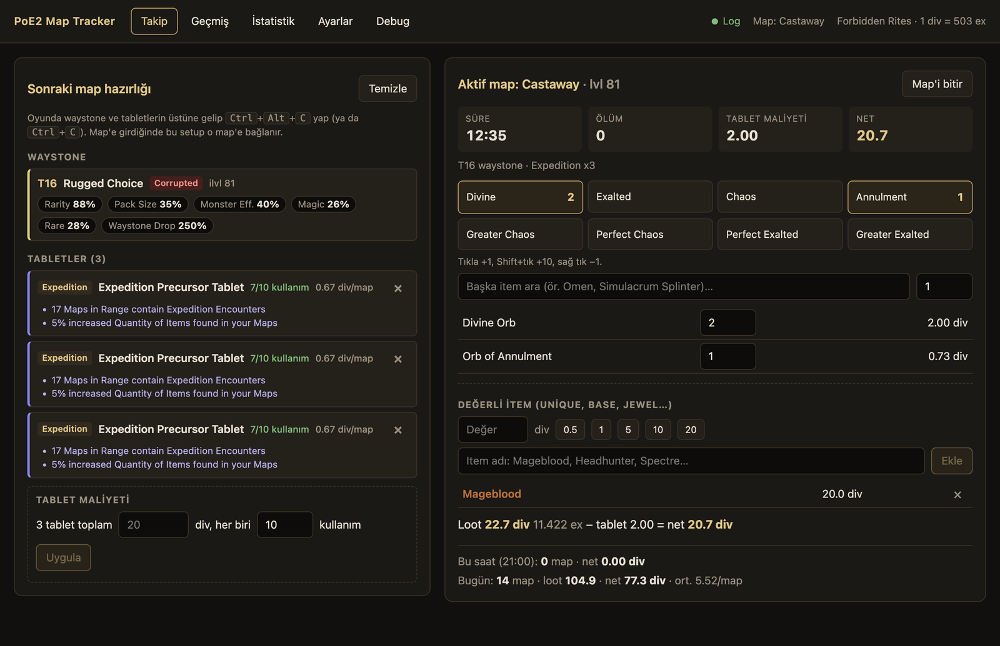
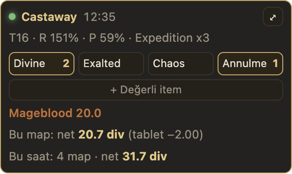
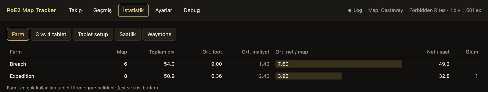
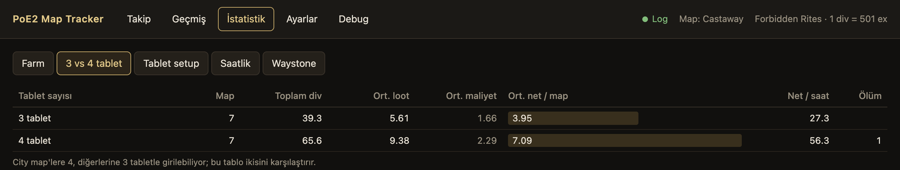
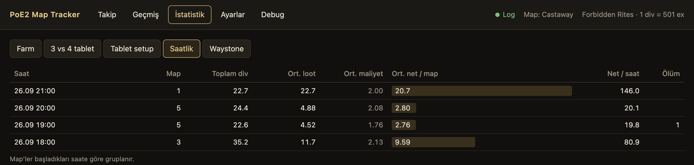
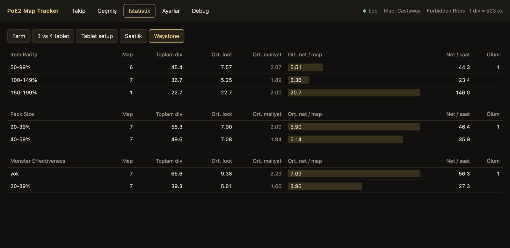
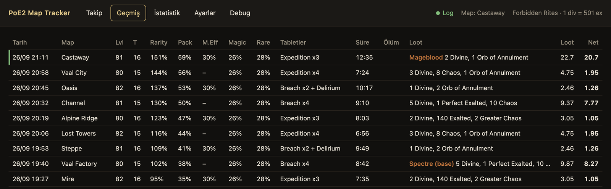

<p align="center">
  
</p>

<p align="center">
  <a href="../../releases/latest"></a>
  
  
  
</p>

<p align="center">
  <a href="../../releases/latest"><b>⬇️ İndir (portable .exe)</b></a> ·
  <a href="#-nasıl-çalışır">Nasıl çalışır</a> ·
  <a href="#%EF%B8%8F-kısayollar">Kısayollar</a> ·
  <a href="#-istatistik">İstatistik</a>
</p>

---

Her map'e **hangi waystone ve tabletlerle** girdiğini, **süreyi**, **ölümleri**, **loot'u** ve **net kârı** (loot − tablet maliyeti) otomatik kaydeder. Oyunun üstünde duran küçük panelden alt-tab yapmadan loot girersin.

<p align="center">
  
</p>

## ✨ Özellikler

| | |
| :-- | :-- |
| 🗺️ **Otomatik map takibi** | Map'e giriş/çıkış, area level, süre ve ölümler `Client.txt`'ten gelir |
| 🪨 **Waystone & tablet** | `Ctrl+Alt+C` ile Rarity, Pack Size, Monster Effectiveness ve tablet türleri kaydedilir |
| 💰 **Loot & değerli item** | Currency butonları + unique'ler için elle Divine değeri (ör. `20` Mageblood) |
| 🧾 **Tablet maliyeti** | "3 tablet 20 div, 10 kullanım" gir; map başına maliyet ve net kâr otomatik |
| 📊 **İstatistik** | Farm, 3 vs 4 tablet, setup, saatlik ve waystone stat aralıkları |
| 🖥️ **Overlay** | Oyun üstünde her zaman görünen panel, tıklayınca oyundan odağı çalmaz |
| 📈 **Canlı fiyat** | poe.ninja PoE2 fiyatları, Divine bazında, 30 dk'da bir |

## 🚀 Nasıl çalışır

> [!TIP]
> Oyunu **Windowed Fullscreen** modda aç, overlay ancak böyle görünür.

1. **Hazırlık** (hideout'ta): Waystone'un ve tabletlerin üstüne gelip `Ctrl+Alt+C` yap. "Sonraki map hazırlığı" kartına düşerler.
2. **Tablet maliyeti:** Tabletlerin altına toplam fiyatı ve kullanım sayısını gir, **Uygula**. Tabletler map'ten sonra hazırlıkta kalır, hakları azalır, bitince düşer.
3. **Map'e gir:** Otomatik algılanır. Hideout'a gidip aynı map'e dönersen aynı kayıt devam eder.
4. **Loot gir:** Butonlara tıkla ya da değerli item'ı Divine değeriyle ekle.
5. **Sonuç:** Geçmiş'te tablo, İstatistik'te karşılaştırmalar, Ayarlar'dan Excel için CSV.

## ⌨️ Kısayollar

| Tuş | Ne yapar |
| :-- | :-- |
| <kbd>Ctrl</kbd> + <kbd>Alt</kbd> + <kbd>C</kbd> | Oyunda item üstünde: waystone / tablet'i hazırlığa ekler (<kbd>Ctrl</kbd> + <kbd>C</kbd> de olur) |
| <kbd>Ctrl</kbd> + <kbd>Shift</kbd> + <kbd>O</kbd> | Overlay'i aç / kapat |
| <kbd>Ctrl</kbd> + <kbd>Shift</kbd> + <kbd>S</kbd> | Ekran görüntüsü alır, aktif map'e (hideout'taysan sonraki map'e) ekler |
| Tık · <kbd>Shift</kbd>+Tık · Sağ tık | Loot butonu: +1 · +10 · −1 |
| <kbd>Enter</kbd> · <kbd>Esc</kbd> | Değerli item formu: ekle · vazgeç |

Kısayollar Ayarlar'dan değiştirilebilir.

## 🖥️ Overlay



Sağ üstte duran küçük panel:

- Aktif map, süre, ölüm, waystone ve tablet setup'ı
- İlk 4 loot butonu
- **+ Değerli item**: oyundan çıkmadan ekle, yazarken klavye panele geçer, bitince oyuna döner
- Bu map'in ve bu saatin net kârı
- Sürükle-bırak, yeri hatırlanır, opaklık ayarlanabilir

<br clear="right">

## 📊 İstatistik

Her tabloda map sayısı, ortalama loot, ortalama maliyet, **net/map** ve **net/saat** var.

<details open>
<summary><b>Farm karşılaştırması</b> (Expedition, Breach…)</summary>
<br>

</details>

<details>
<summary><b>3 vs 4 tablet</b> (city map'ler 4 tablet alır)</summary>
<br>

</details>

<details>
<summary><b>Saatlik</b></summary>
<br>

</details>

<details>
<summary><b>Waystone</b> (Rarity, Pack Size, Monster Effectiveness aralıkları)</summary>
<br>

</details>

<details>
<summary><b>Geçmiş</b> (tüm map'ler)</summary>
<br>

</details>

## 🔒 Güvenli mi?

| Veri | Kaynak |
| :-- | :-- |
| Map, süre, ölüm | `Client.txt` log dosyası (GGG izin veriyor) |
| Waystone / tablet | Oyunun kendi `Ctrl+C` item metni (pano) |
| Fiyatlar | [poe.ninja](https://poe.ninja/poe2) |

> [!IMPORTANT]
> Oyunun belleğini okumaz, oyuna tuş göndermez, oyun dosyalarına dokunmaz. [GGG'nin üçüncü parti araç kurallarına](https://www.pathofexile.com/developer/docs) uygundur.

Veriler bilgisayarında durur: `%APPDATA%\poe2-map-tracker\tracker-data.json`

## 🛠️ Sorun giderme

| Sorun | Çözüm |
| :-- | :-- |
| Üstte **Log** kırmızı | Ayarlar → Client.txt → `...\Path of Exile 2\logs\Client.txt` seç |
| Map algılanmıyor | Debug sekmesinde log satırları görünüyor mu bak, satırları issue olarak paylaş |
| Waystone statları boş | Debug sekmesindeki pano metnini issue olarak paylaş |
| SmartScreen uyarısı | Build imzasız: **More info → Run anyway** |

<details>
<summary><b>Geliştirme</b></summary>

```bash
npm install
npm test           # parser ve tracker testleri
npm start          # uygulamayı çalıştır
npm run dist:win   # Windows exe -> release/
```

Electron + React + TypeScript, Vite ile.
</details>

<p align="center"><sub>Ekran görüntüleri demo verisiyle alınmıştır.</sub></p>
